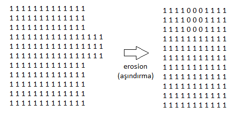
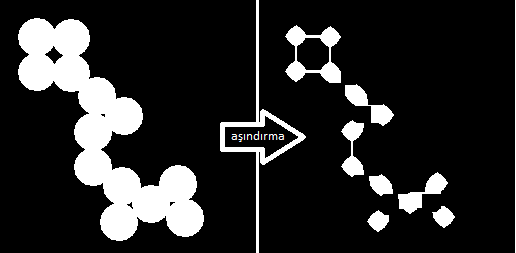
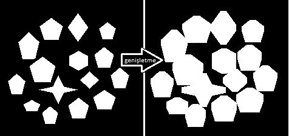
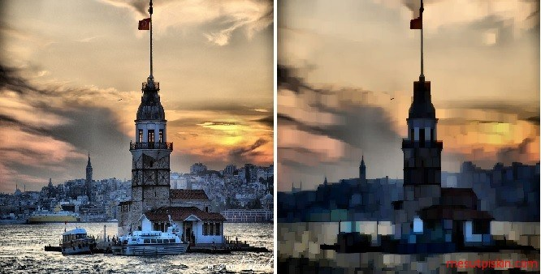
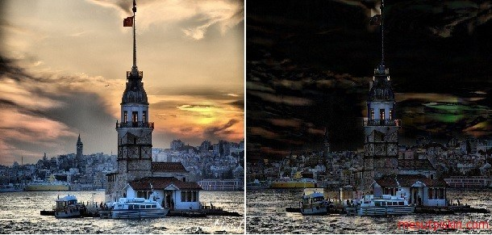
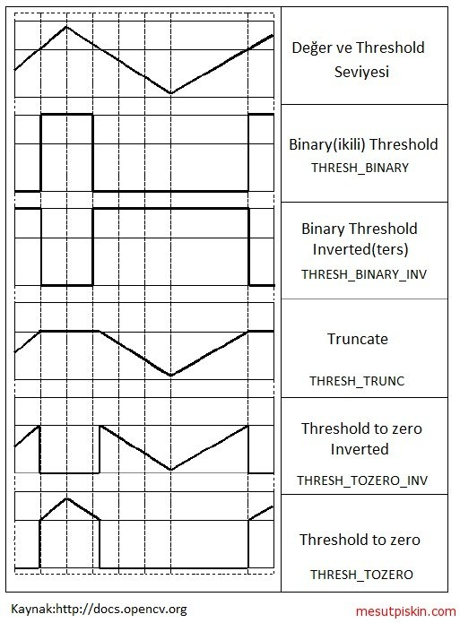
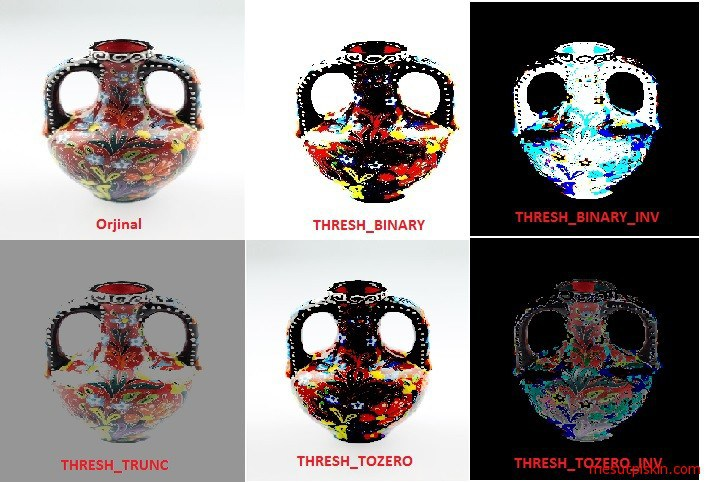

**Morfolojik Görüntü işleme** 
-----------------------------
Morfoloji (İngilizce morphology) şekil bilimi olarak tanımlanmaktadır. Başlı başına bilim olan bu alanı tüm yöntemleri ile OpenCV Kütüphanesi içerisine taşımak elbette ki mantıklı bir seçim değildir bu yüzden ihtiyaç duyulabilecek bazı teknikler aktarılmıştır. Morfolojik görüntü işleme (morphology ) görüntü içindeki nesnelerin şekilleri (morfolojisi) ile ilgilenen bir dizi görüntü işleme tekniklerini tarif etmektedir.OpenCV içerisinde morfolojik işlem operatörleri Imgproc içerisinde bulunmaktadır.

Morfoloji’nin bir şekil bilimi olduğunu söylemiştik, çalışılan görüntü üzerindeki şekillerin yorumlanması, analiz edilmesi, istenilen bilginin çıkartılması, inceltme, görüntü sıkıştırma, köşe analizi, bozuk görüntü onarma (eksik veya fazla piksellerin çıkarılması, eklenmesi), dokuların tespiti gibi işlemlerde sıklıkla başvurulmaktadır.

* Erosion (Aşındırma)
* Dilation (Yayma – Genişletme)
* Opening (Açınım)
* Closing (Kapanım)
* Morphological Gradient
* Top Hat
* Black Hat


**Erosion (Aşındırma)**

Bu operatör görüntü üzerinde bir aşındırma işlemi uygular. Parametrelere göre belirtilen alan içerisindeki pikseller aşındırılır ve gürültülü olarak adlandırılan bozuk olan görüntü, gürültüden arındırılarak temizlenir. Bütün bu olaylar matematiksel olarak tanımlanmıştır ve diziler üzerinde gerçekleştirilir. Aşağıdaki görseller yardımı ile nasıl çalıştığını somut olarak görelim. İlk görüntü dizisi aşındırma ile gürültüden arındırılmaktadır.



Erosion işlemi için kullanacağımız metot erode(), bu metot imgproc içerisinde yer almaktadır.  Erode metodunun üç adet overloadı bulunmaktadır. Kullandığımız parametre olarak giriş mat nesnesi, işlem sonucunu atamak için çıkış mat nesnesi ve yapılandırma için bir nesne almaktadır. Bu nesne yapısal element olarak adlandırılır (Structuring Element) ve yayma işleminin şeklini belirler. Yapısal elementin merkez noktası üzerine giriş görüntüsünün pikselleri bu noktaya oturtularak oluşturulur. Bu şekiller Imgproc içerisinde tanımlanmışlardır, aşağıdaki örnekte MORPH_ERODE kullandık.

*Java:*
``` Java
import org.opencv.core.Core;
import org.opencv.core.Mat;
import org.opencv.core.Size;
import org.opencv.imgcodecs.Imgcodecs;
import org.opencv.imgproc.Imgproc;

public class Erosion {
	public static void main(String[] args) {
		System.loadLibrary(Core.NATIVE_LIBRARY_NAME);

		Mat girisGoruntu=new Mat();
   		girisGoruntu=Imgcodecs.imread("C:\\1.png");
		Mat cikisGoruntu=new Mat();
        //Aşındırma işlemi
        Imgproc.erode(girisGoruntu, cikisGoruntu, Imgproc.getStructuringElement(Imgproc.MORPH_ERODE, new Size(15,15))); 
       
		Imgcodecs.imwrite("C:\\2.png", cikisGoruntu);
	}
}
```

*Python:*
```Python
import cv2
import numpy as np

frame = cv2.imread('resim.png',0)
#Numpy ile kernel matris tanımı
kernel = np.ones((5,5),np.uint8)
#Aşındırma işlemi
sonuc = cv2.erode(frame,kernel,iterations = 1)
cv2.imshow("Sonuc", sonuc)
cv2.waitKey(0)
```


Verilen parametreler doğrultusunda giriş görüntüsü üzerinde aşındırma operatörü kullanılmıştır. 1.png olarak adlandırılan görüntüyü aşağıda solda görmektesiniz bu input olarak tanımlanan girisGoruntu mat nesnesi içerisinde tutulan, cikisGoruntu olarak tanımlanan mat nesnesini oluşturulan ve 2.png olarak adlandırılan görüntüyü ise sağda görmektesiniz.




**Dilation (Yayma – Genişletme)**

Bu operatör giriş olarak verilen görüntü üzerinde parametreler ile verilen alan içerisindeki sınırları genişletmektedir, bu genişletme sayesinde piksel gurupları büyür ve pikseller arası boşluklar küçülür. OpenCV dilation operatörü için Imgproc içerisinde dilate() operatörü bulunmaktadır. Bu metot parametre olarak giriş görüntüsü olacak bir mat nesnesi, çıkış görüntüsü için ikinci bir mat nesnesi ve yapısal element almaktadır.

*Java:*
``` Java
import org.opencv.core.Core;
import org.opencv.core.Mat;
import org.opencv.core.Size;
import org.opencv.imgcodecs.Imgcodecs;
import org.opencv.imgproc.Imgproc;

public class Dilation {
	public static void main(String[] args) {
		System.loadLibrary(Core.NATIVE_LIBRARY_NAME);

		Mat girisGoruntu=new Mat();
		girisGoruntu=Imgcodecs.imread("C:\\ 1.jpg");	
		Mat cikisGoruntu=new Mat();
		//dilate (genişletme) operatörü
                Imgproc.dilate(girisGoruntu, cikisGoruntu,Imgproc.getStructuringElement(Imgproc.MORPH_RECT, new Size(25,25)));
		Imgcodecs.imwrite("C:\\2.jpg", cikisGoruntu);
	}
}
```

*Python:*
```Python
import cv2
import numpy as np

frame = cv2.imread('resim.png',0)
#Numpy ile kernel matris tanımı
kernel = np.ones((15,15),np.uint8)
#Aşındırma işlemi
sonuc = cv2.dilate(img,kernel,iterations = 1)
cv2.imshow("Sonuc", sonuc)
cv2.waitKey(0)

```

Aşağıdaki çıktıda sol tarafta bulunan görüntü 1.jpg olarak adlandırılan giriş mat nesnesi, sağındaki ise 2.jpg olarak işlem sonucunda oluşturulan çıktı görüntü. Gördüğünüz üzere giriş görüntüsünde bulunan beyaz şekiller dilation operatörü uygulandığında bir birlerine yaklaşmışlardır. Burada önemli nokta zeminin, siyah nesneler beyaz olması ve yapısal element. Yapısal element üzerindeki değişikler ile aralarındaki mesafe daha da azaltılıp birleştirilebilirdi.




Diğer operatörleri kullanmak için daha önceki örneklerde yaptığımız gibi erode ve dilate metotlarını kullanarak gerçekleştirebilirsiniz fakat OpenCV içerisinde morfolojik operatörleri yönetmek için yazılmış bir metot hazırda bulunmaktadır. Imgproc içerisinde yer alan morphologyEx() ile operatörler yönetilebilmektedir. Bu metot parametre olarak giriş görüntüsü için mat nesnesi, işlem sonucu için bir mat nesnesi, uygulanacak olan operatör ve yapısal element almaktadır.


**Opening (Açınım)**

Erosion ve dilation operatörlerinin görüntü üzerine birlikte uygulanması ile gerçekleşir.  Öncelikli olarak erosion operatörü uygulanır ve ardından dilation operatörü uygulanır. (Imgproc.MORPH_OPEN)

*Java:*
``` Java
Imgproc.morphologyEx(girisGoruntu, cikisGoruntu, Imgproc.MORPH_OPEN, Imgproc.getStructuringElement(Imgproc.MORPH_RECT, new Size(25,25)));
```

*Python:*
```Python
opening = cv2.morphologyEx(img, cv2.MORPH_OPEN, kernelMat)
```




**Closing (Kapanım)**
Görüntüye dilation operatörü uygulanır ve ardından Erosion operatörü uygulanır. (Imgproc.MORPH_CLOSE)

*Java:*
``` Java
Imgproc.morphologyEx(girisGoruntu, cikisGoruntu, Imgproc.MORPH_CLOSE, Imgproc.getStructuringElement(Imgproc.MORPH_RECT, new Size(25,25)));
```

*Python:*
```Python
closing = cv2.morphologyEx(img, cv2.MORPH_CLOSE, kernelMatris)
```


**Gradyan**

Dilation ve Erosion operatörü arasındaki farktır. Nesnelerin ana hatlarını belirlemek için kullanılır. Sınır çizgilerini tam hatlarıyla belirlemek için yapısal element, görüntüye göre özelleştirilmelidir. (Imgproc.MORPH_GRADIENT)


*Java:*
``` Java
Imgproc.morphologyEx(girisGoruntu, cikisGoruntu, Imgproc.MORPH_GRADIENT, Imgproc.getStructuringElement(Imgproc.MORPH_RECT, new Size(25,));
```

*Python:*
```Python
morfolojik_gradient = cv2.morphologyEx(img, cv2.MORPH_GRADIENT, kernelMatris)
```


**Top Hat**

Bu operatör giriş olarak verilen görüntüden, opening (açınım) operatörü uygulanmış halini çıkarır. (Imgproc.MORPH_TOPHAT)

*Java:*

``` Java
Imgproc.morphologyEx(girisGoruntu, cikisGoruntu, Imgproc.MORPH_GRADIENT, Imgproc.getStructuringElement(Imgproc.MORPH_RECT, new Size(25,2);
```

*Python:*
```Python
tophat = cv2.morphologyEx(img, cv2.MORPH_TOPHAT, kernelMatris)
```




 ## Thresholding (Eşikleme)

Giriş olarak verilen görüntüyü ikili görüntüye çevirmek için kullanılan bir yöntemdir. İkili görüntü (binary), görüntünün siyah ve beyaz olarak tanımlanmasıdır. Morfolojik operatörler gibi görüntü üzerindeki gürültüleri azaltmak veya nesne belirlemek gibi farklı amaçlar için kullanılır. Giriş olarak verilen görüntü üzerinde uygulanan thresholding tipine bağlı olarak, pikselleri verilen eşik değerine göre siyah ya da beyaz olarak günceller.

OpenCV içerisindeki sık kullanılan eşikleme tipleri:

 * THRESH_BINARY
 * THRESH_BINARY_INV
 * THRESH_TRUNC
 * THRESH_TOZERO
 * THRESH_TOZERO_INV

Thresholding işlemi için Imgproc içerisindeki threshold()metodunu kullanacağız. Bu metot beş adet parametre almaktadır. Kaynak mat nesnesi yani giriş görüntüsü, hedef olarak ikinci bir mat nesnesi bu hedef nesne işlem sonucunu tutmak için, thresh olarak adlandırılan parametre eşik değeri, THRESH_BINARY ve THRESH_BINARY_INV gibi tipler için kullanılmak üzere maksimum değer ve yukarıda belirtilenler gibi threshold tipini parametre olarak almaktadır.


*Java:*

``` Java
Imgproc.threshold(kaynakMat,hedefMat,esikDegeri,maxDeger,threshoidngTipi);
```

*Python:*
```Python
hedefMat = cv.threshold(kaynakMat,esikDegeri,maxDeger,cv.threshoidngTipi)
```

THRESH_BINARY:

Kaynak olarak alınan görüntü üzerindeki piksel,esikDegeri olarak verilen değerden büyükse maksDeger olarak verilen parametre değerine atanır.

 
THRESH_BINARY_INV:

Kaynak olarak alınan görüntü üzerindeki piksel,esikDegeri olarak verilen değerden küçükse maksDeger olarak verilen parametre değerine atanır.THRESH_BINARY_INV, THRESH_BINARY‘nin karşıtı olarak kullanılabilir.


THRESH_TRUNC:

Kaynak olarak alınan görüntü üzerindeki piksel,


THRESH_TOZERO:

Kaynak olarak alınan görüntü üzerindeki piksel,sınır olarak verilen değerden büyük olması durumunda piksel değeri korunacak, küçük olması durumunda ise piksel siyah olarak atanacaktır.

 
THRESH_TOZERO_INV:

Kaynak olarak alınan görüntü üzerindeki piksel,sınır olarak verilen değerden küçük olması durumunda piksel değeri korunacak, büyük olması durumunda ise piksel siyah olarak atanacaktır.

 

Aşağıdaki görselde kaynak üzerine etki eden threshold tipleri grafiksel olarak ifade edilmiştir.




Threshold tiplerine göre ve kaynak görüntü üzerindeki farklılıklara bakalım.


RGB Görüntü:



Siyah - Beyaz Görüntü:


